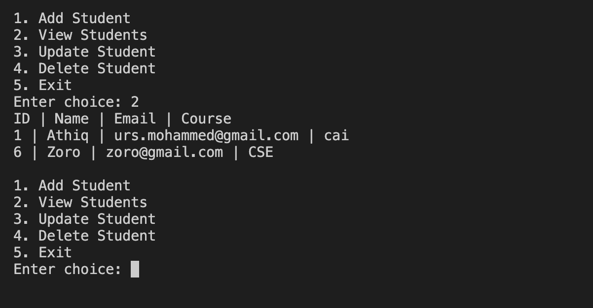

# Student Management System using Java and MySQL

A console-based Java application for managing student records with secure CRUD operations (Create, Read, Update, Delete) using MySQL and JDBC.

## Features
- Console-based menu-driven interface to perform CRUD operations
- Add new students to the database
- View all student records
- Update existing student details
- Delete student records
- Secure database operations using **PreparedStatement**

## Tech Stack
- **Java** – Core logic and console interface
- **MySQL** – Database for storing student records
- **JDBC** – Java Database Connectivity for MySQL integration
- **MySQL Connector/J** – JDBC driver

## Project Structure
```
├── StudentManagementSystem.java   # Main Java source file
├── student_db_setup.sql           # SQL script to create DB and table
├── mysql-connector-j-9.3.0.jar    # JDBC driver
└── README.md                      # Project documentation
```

## Database Setup
1. Run the [`student_db_setup.sql`](student_db_setup.sql) script in MySQL to create the `student_db` database and `students` table.
2. Update database credentials in `StudentManagementSystem.java` if necessary.

```sql
CREATE DATABASE IF NOT EXISTS student_db;
USE student_db;

CREATE TABLE IF NOT EXISTS students (
    id INT PRIMARY KEY AUTO_INCREMENT,
    name VARCHAR(100),
    email VARCHAR(100),
    course VARCHAR(100)
);
```

## How to Run
1. Compile the Java file:

```bash
javac -cp .:mysql-connector-j-9.3.0.jar StudentManagementSystem.java
```

2. Run the program:

```bash
java -cp .:mysql-connector-j-9.3.0.jar StudentManagementSystem
```

**Note for Windows users:** use `;` instead of `:` in the classpath, for example:

```powershell
javac -cp .;mysql-connector-j-9.3.0.jar StudentManagementSystem.java
java -cp .;mysql-connector-j-9.3.0.jar StudentManagementSystem
```

## Example Menu

```
1. Add Student
2. View Students
3. Update Student
4. Delete Student
5. Exit
```

## Screenshot


*Console output for the “View Students” feature displaying sample records.*

## License
This project is licensed under the MIT License — see the `LICENSE` file for details (or add one).

**Author:** [Syed Mohammed Athiq](https://github.com/MohammedAthiq)